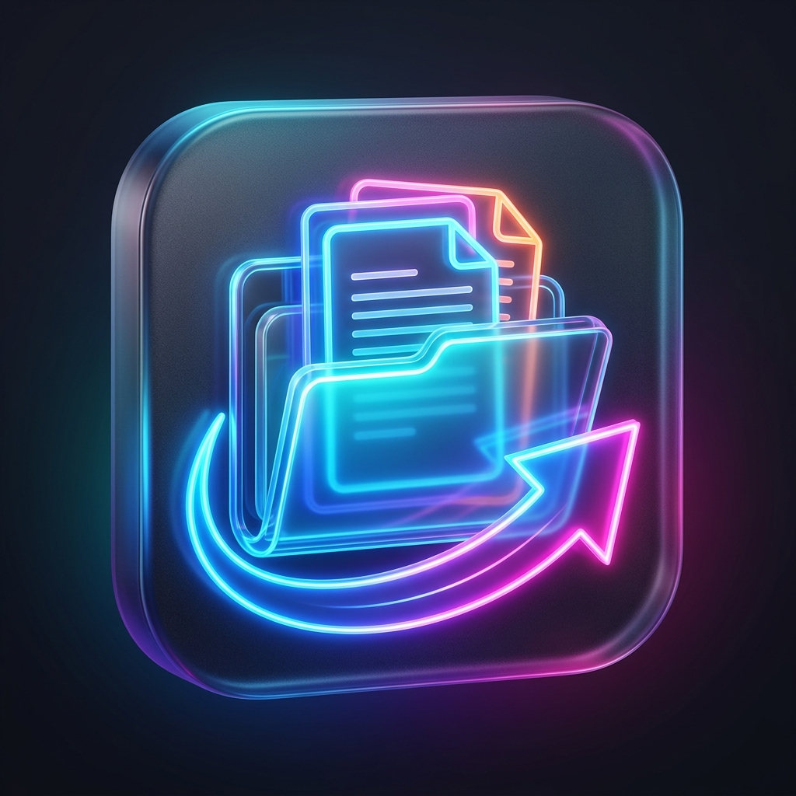
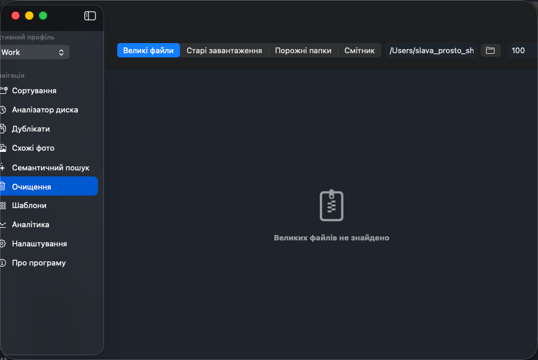
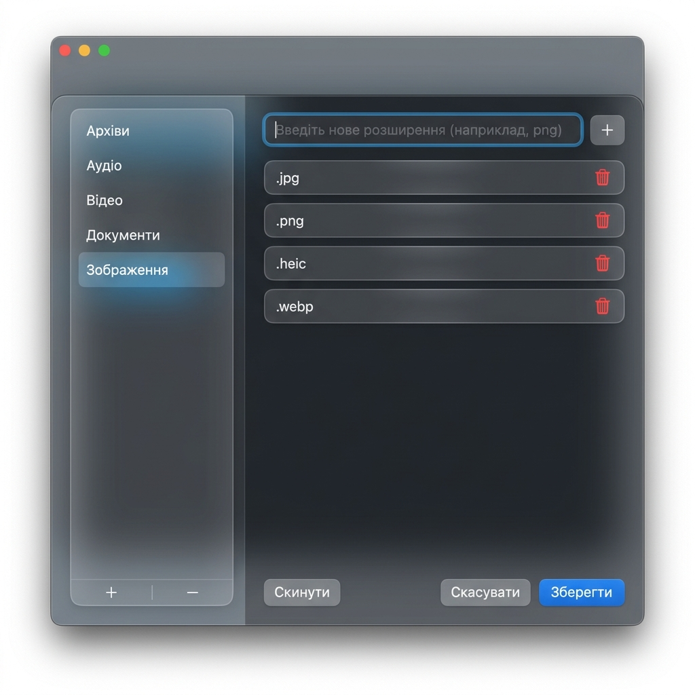
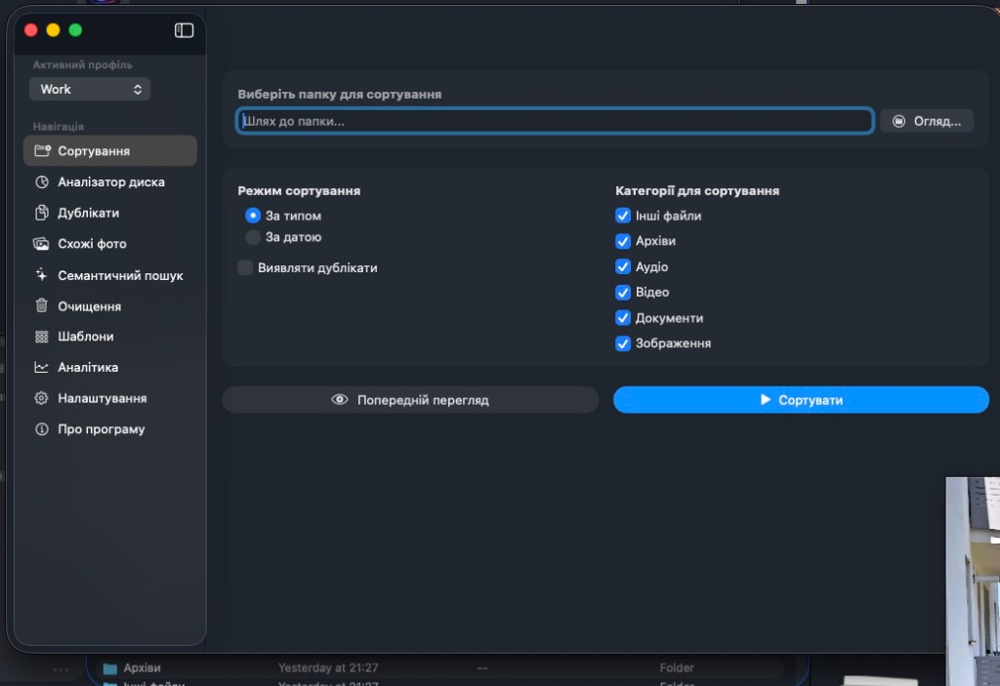
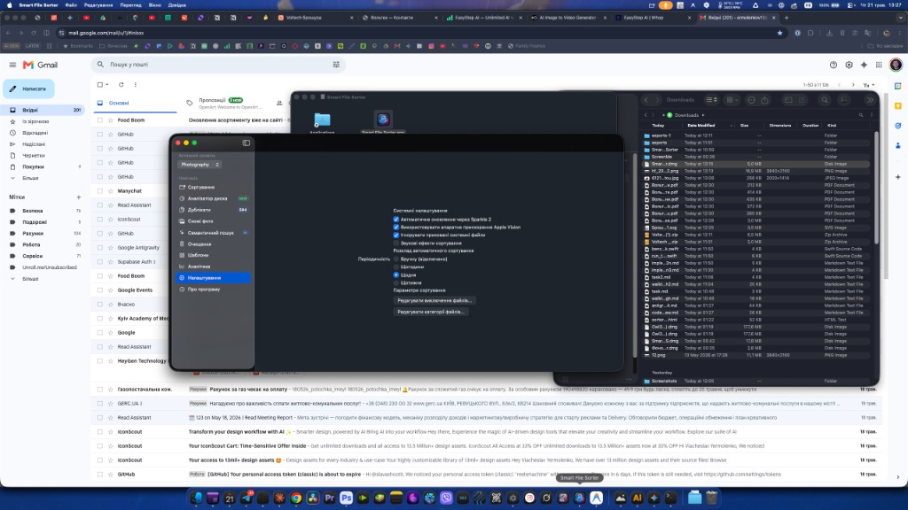
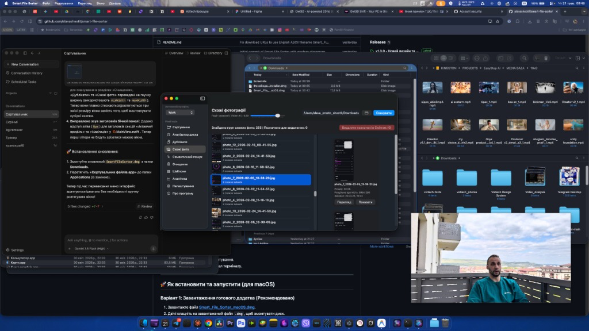
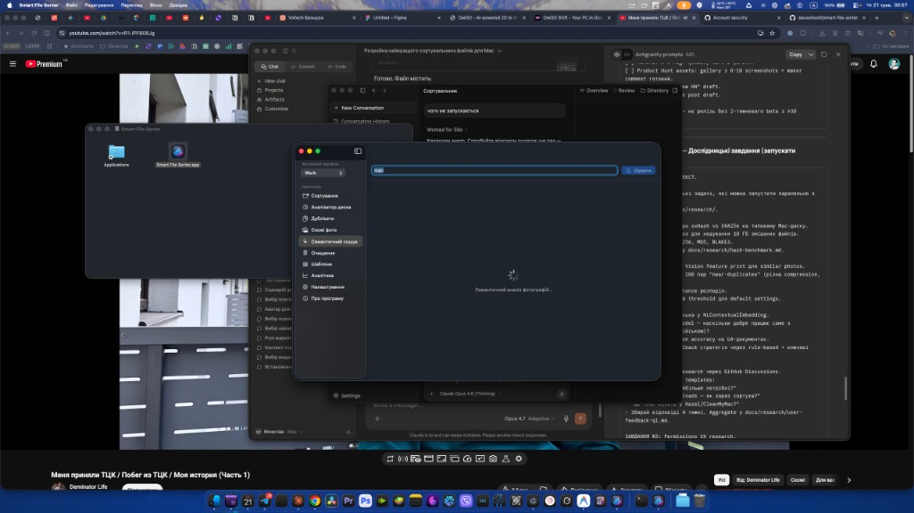
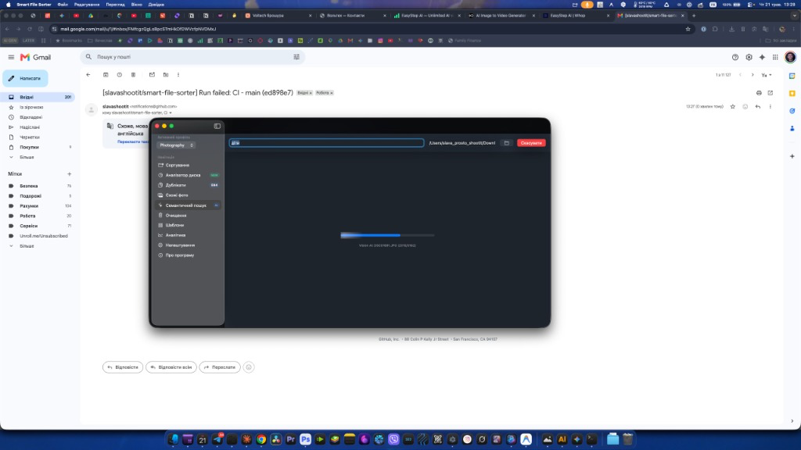
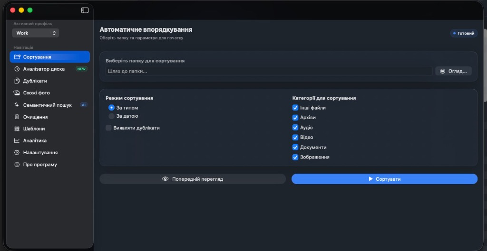

<p align="center">
  
</p>

<h1 align="center">Smart File Sorter</h1>

<p align="center">
  <strong>Premium open-source file manager for macOS.<br>
  Hazel automation + CleanMyMac cleanup + Gemini duplicates,<br>
  all native, all free.</strong>
</p>

<p align="center">
  <a href="https://github.com/slavashootit/smart-file-sorter/actions/workflows/ci.yml"></a>
  
  
  
  <a href="https://github.com/slavashootit/smart-file-sorter/releases"></a>
  <a href="LICENSE"></a>
</p>

<p align="center">
  <a href="https://github.com/slavashootit/smart-file-sorter/releases/download/v1.5.0/SmartFileSorter.dmg">
    
  </a>
</p>

---

## 📸 Screenshot Gallery

<p align="center">
  <br>
  <em>Main View with Liquid Glass styling and animated Mesh Background</em>
</p>

<p align="center">
  <br>
  <em>Sidebar with NavBadges (NEW/AI/347) and customizable category/exclusion forms</em>
</p>

<p align="center">
  <br>
  <em>Duplicate Finder featuring two-pass XXHash64 validation and smart selection learning</em>
</p>

<p align="center">
  <br>
  <em>Semantic Search View powered by local Vision AI to find images using natural language</em>
</p>

<p align="center">
  <br>
  <em>Dashboard View showing statistics, history, metrics, and graphs</em>
</p>

<p align="center">
  <br>
  <em>Interactive Sunburst Chart showing disk space distribution (DaisyDisk-style)</em>
</p>

<p align="center">
  <br>
  <em>System Cleanup view for old downloads, large files, and caches</em>
</p>

<p align="center">
  <br>
  <em>Similar Photos detection layout using Vision feature prints</em>
</p>

---

## 🚀 Features

### 🤖 Smart Organization
* **Rules Engine**: Automate folder organization with **14 distinct conditions** (file type, size, date created/modified, extension, name regex, and more) and **9 flexible actions** (move, copy, tag, rename with templates, trash, and run scripts).
* **Watch Folders**: Real-time folder watching utilizing the native macOS FSEvents API to instantly organize incoming files.
* **Profiles**: Switch between different rule configurations for work, personal, or temporary sorting.
* **Schedule**: Automate execution in the background with `NSBackgroundActivityScheduler` for non-intrusive operations.

### 🔍 Cleanup
* **Duplicate Finder**: High-performance duplicate detection powered by the extremely fast `XXHash64` algorithm. Employs a smart two-pass check (fast partial hash first, full hash second) preventing false positives.
* **Similar Photos**: Identifies visually similar photos using the native Apple Vision Framework (`VNFeaturePrintObservation`).
* **Large Files & Old Downloads**: Locate space hogs and ancient files with dynamic sliders to filter by size and age.

### 🧠 Local AI (Free & Private)
* **Semantic Search**: Search your local images and PDFs using natural language. Employs Apple's local CoreML/Vision models on-device—fully private, fast, and completely free.
* **Image Classification**: Automatically categorize photos by content (e.g., documents, nature, receipts).
* **OCR Database**: High-speed offline OCR scanning on images to index and search textual content.
* **Smart Selection Learning**: Learn from user deletion habits to automatically suggest which duplicate files to keep or trash.

### 📊 Analytics
* **Dashboard**: Modern dashboard displaying sorted files, total space organized, total space freed, and breakdown charts.
* **Sunburst Disk Visualization**: Interactive radial breakdown of disk usage (similar to DaisyDisk) with fast animations.
* **Heatmap & Trend Growth**: Map out folder growth and sorting activities over time to find where files build up.
* **CSV Export**: Export detailed logs, history, and analytics for external reporting.

### ✨ Native macOS Architecture
* **Liquid Glass UI**: Fully native SwiftUI interface adopting glassmorphism, animated mesh gradient backgrounds, mouse-following Spotlight hover highlights, and smooth physics-based transitions.
* **Siri Shortcuts & Intents**: Integrate file sorting into your native macOS automations and Siri commands.
* **Quick Look**: Standard macOS Spacebar preview for duplicates, images, and videos.
* **Services Menu**: Right-click context menu integration to quickly sort files from Finder.
* **Sparkle Auto-Updates**: Secure and seamless automatic updates via the Sparkle framework.

---

## 📊 Comparison Table

| Feature | Smart Sorter | Hazel | CleanMyMac | Gemini 2 |
| :--- | :---: | :---: | :---: | :---: |
| **Rules engine** | ✅ | ✅ | ❌ | ❌ |
| **Duplicates** | ✅ | ❌ | ✅ | ✅ |
| **Similar photos** | ✅ | ❌ | ✅ | ✅ |
| **Semantic AI** | ✅ | ❌ | ❌ | ❌ |
| **Watch folders** | ✅ | ✅ | ❌ | ✅ |
| **Local AI** | ✅ | ❌ | ❌ | ❌ |
| **Price** | **Free** | $42 | $39.95/yr | freemium |
| **Open source** | ✅ | ❌ | ❌ | ❌ |

---

## 🛠️ Installation & Building

### Standard Install
Download the pre-compiled DMG package from the official releases:
* **[Download SmartFileSorter v1.5.0 .dmg](https://github.com/slavashootit/smart-file-sorter/releases/download/v1.5.0/SmartFileSorter.dmg)**

Drag the app to your `/Applications` directory and launch.

### Build from Source
Ensure you have Xcode 15.0+ and macOS 13+ installed.

1. Clone the repository:
   ```bash
   git clone https://github.com/slavashootit/smart-file-sorter.git
   cd smart-file-sorter
   ```
2. Build the app using Swift PM:
   ```bash
   swift build -c release
   ```
3. Run the application:
   ```bash
   swift run SmartFileSorter
   ```
4. Package the application into a `.dmg`:
   ```bash
   ./build_dmg.sh
   ```

### Running Tests
The project contains integration and unit tests using `XCTestCase`:
```bash
swift test --parallel --enable-code-coverage
```

### Benchmarks
To run the performance benchmarks for hashing and cache:
```bash
swift run -c release --package-path . benchmark
```

---

## 🐍 Legacy Python CLI (Fallback)
If you require a headless CLI tool for cron jobs or terminal automation, the legacy Python engine is preserved under `/python/`:

1. Navigate to directory:
   ```bash
   cd python
   ```
2. Install dependencies:
   ```bash
   pip3 install -r requirements.txt
   ```
3. Run command:
   ```bash
   python3 file_sorter.py --source /path/to/folder --mode type
   ```

---

## 🤝 Contributing

We welcome contributions! Please open an issue or submit a pull request.
1. Fork the Project
2. Create your Feature Branch (`git checkout -b feature/AmazingFeature`)
3. Commit your Changes (`git commit -m 'Add some AmazingFeature'`)
4. Push to the Branch (`git push origin feature/AmazingFeature`)
5. Open a Pull Request

---

## 📄 License

Distributed under the MIT License. See [LICENSE](LICENSE) for more information.
