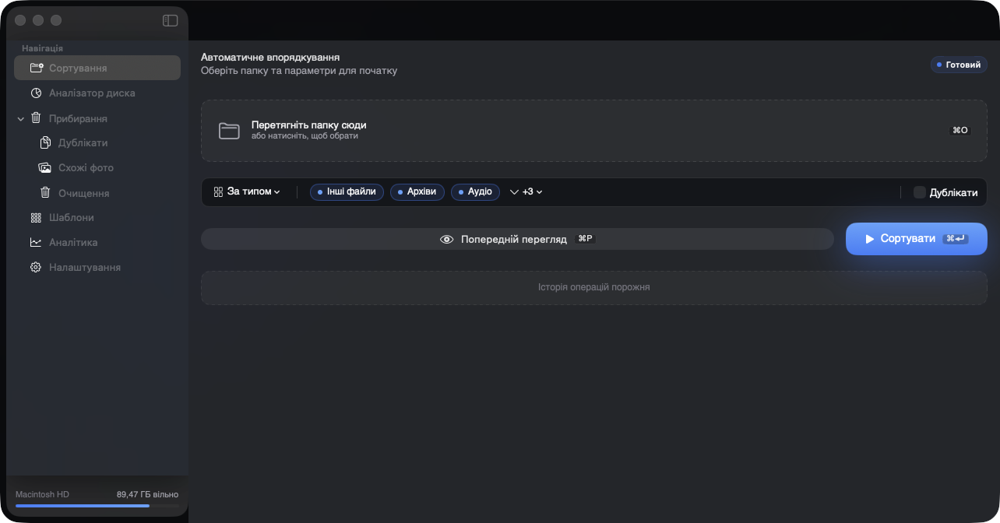
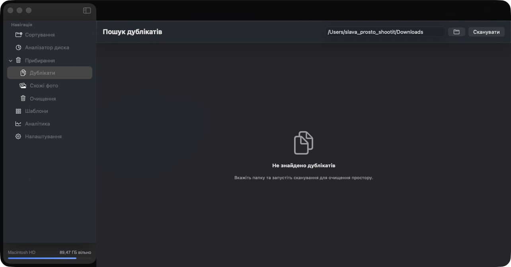
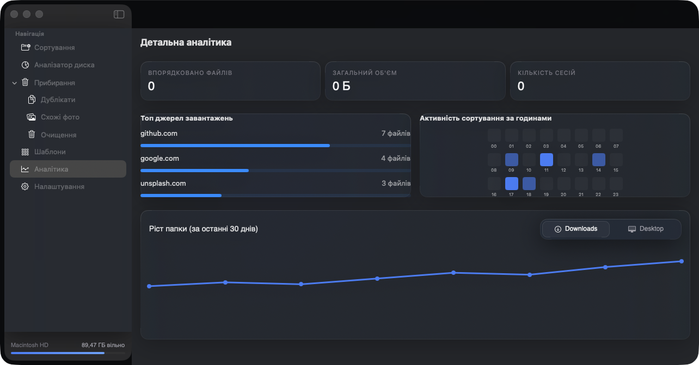
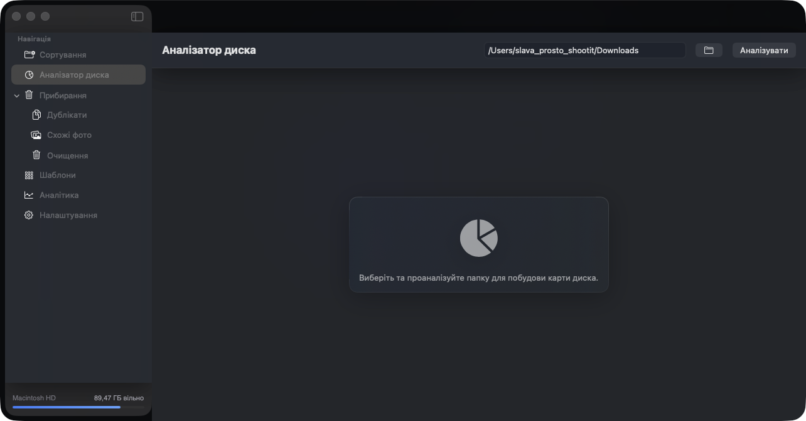

<div align="center">
  <!-- TODO: move or copy app_icon.png to docs/assets/icon.png -->
  

  # Smart File Sorter

  **Hazel-level automation · DaisyDisk-style visualization · Gemini duplicate detection**
  All native. All free. No cloud.

  [](https://github.com/slavashootit/smart-file-sorter/actions)
  [](#)
  [](#)
  [](#)
  [](https://github.com/slavashootit/smart-file-sorter/releases/latest)
  [](#license)

  [⬇ Download v1.6.0 .dmg](https://github.com/slavashootit/smart-file-sorter/releases/download/v1.6.0/SmartFileSorter-1.6.0.dmg) &nbsp;·&nbsp;
  [View Releases](https://github.com/slavashootit/smart-file-sorter/releases) &nbsp;·&nbsp;
  [Changelog](CHANGELOG.md)
</div>

## Screenshots

| Sorting | Cleaning hub | Analytics | Disk Analyzer |
|---------|-------------|-----------|---------------|
|  |  |  |  |

## What is Smart File Sorter

Smart File Sorter is a **free, open-source** file management utility for macOS that combines
the best of paid alternatives — rule-based automation, duplicate detection,
visual disk analysis — into a single native app with no cloud dependency
and no subscription.

Built with Swift 5.9 + SwiftUI. Runs entirely on your Mac.

## Features

### 🗂 Smart Sorting
- Rule engine with 14 conditions, 9 actions, and nested AND/OR logic
- Sort by file type or date with compact one-row filter bar
- Drag-and-drop folder selection with instant path preview
- Real-time operation log during sorting
- 50-session undo history

### 🔍 Cleaning Hub
- **Duplicate finder** — XXHash64 two-pass scan (size → quick hash → full hash)
- **Similar photos** — Vision framework-powered perceptual similarity
- **Cleanup scanner** — large files, old downloads, empty folders, Trash size

### 📊 Disk Visualization
- Sunburst chart with interactive drill-down
- Analytics heatmap: activity by hour, top download sources, 30-day growth
- BentoStat metrics with sparklines

### 🤖 Local AI (Privacy-First)
- Image classification and similarity via Apple Vision framework
- Natural Language processing for Ukrainian text
- No internet connection required. No telemetry without opt-in.

### ⚙️ Automation
- FSEvents folder watcher (watchdog mode)
- Rule templates for common workflows
- Siri Shortcuts + Services menu integration
- Hourly / daily / weekly auto-sort schedule

### ✨ Native macOS Design
- SwiftUI + Liquid Glass (macOS 26 Tahoe ready)
- Geist typography, MagneticButton, Ripple, Film grain, AnimatedNumbers
- Reduce Motion support throughout
- Full Ukrainian localization

## How it compares

| Feature | Smart File Sorter | Hazel | CleanMyMac | Gemini 2 | DaisyDisk |
|---------|:-----------------:|:-----:|:----------:|:--------:|:---------:|
| Rule-based sorting | ✅ | ✅ | ❌ | ❌ | ❌ |
| Duplicate detection | ✅ | ❌ | ✅ | ✅ | ❌ |
| Similar photo finder | ✅ | ❌ | ✅ | ✅ | ❌ |
| Disk visualization | ✅ | ❌ | ✅ | ❌ | ✅ |
| Auto-schedule | ✅ | ✅ | ✅ | ❌ | ❌ |
| Local AI (on-device) | ✅ | ❌ | ❌ | ❌ | ❌ |
| No cloud / no telemetry | ✅ | ✅ | ❌ | ❌ | ✅ |
| Native macOS (Swift) | ✅ | ✅ | ✅ | ✅ | ✅ |
| Open source | ✅ | ❌ | ❌ | ❌ | ❌ |
| **Price** | **Free** | **$42** | **$39.95/yr** | **Freemium** | **$9.99** |

## Installation

### Download (recommended)
1. Download the latest `.dmg` from [Releases](https://github.com/slavashootit/smart-file-sorter/releases/latest)
2. Open the `.dmg` and drag **Smart File Sorter.app** to Applications
3. On first launch: right-click → Open (Developer ID signed, not yet notarized)

**Requirements:** macOS 13 Ventura or later · Apple Silicon or Intel

### Build from source
```bash
git clone https://github.com/slavashootit/smart-file-sorter.git
cd smart-file-sorter
swift build -c release
open .build/release/SmartFileSorter.app
```

## Tech Stack

| Layer | Technology |
|-------|-----------|
| Language | Swift 5.9 |
| UI | SwiftUI, Liquid Glass |
| Hashing | XXHash64 (two-pass duplicate scan) |
| Database | SQLite (WAL mode) — sort history, hash cache |
| AI / Vision | Apple Vision framework, NaturalLanguage |
| Auto-update | Sparkle 2 |
| Distribution | Developer ID + Notarization |
| CI | GitHub Actions |
| Test coverage | XCTest, 80%+ |

## Roadmap

- **v1.7.0** — Smart Scan Dashboard: one-click health scan across all cleaning features, prioritized issue report, one-tap Fix All
- **v2.0** — Foundation Models (macOS 26+), MobileCLIP-S0 for semantic image search, Whisper.cpp for audio file naming
- Node-based rule editor (visual drag-and-drop)
- AI rule suggestions based on sort history

## License

MIT. See [LICENSE](LICENSE) for details.

---

<div align="center">
  Made with Swift in Ukraine 🇺🇦
</div>
