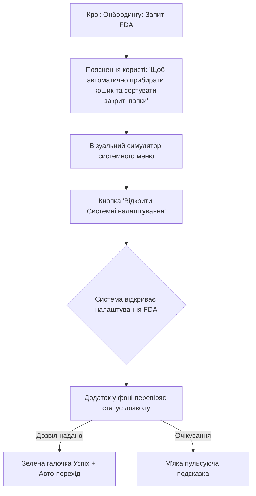

# Звіт R5: Дослідження UX Системних Дозволів на macOS

Дозволи на доступ до файлової системи (Full Disk Access) та керування (Accessibility) часто викликають підозру у користувачів. Ми проаналізували досвід топових утиліт macOS та розробили оптимальний UX-сценарій для Smart File Sorter v2.0.

---

## 🔍 Аналіз підходів успішних macOS утиліт

### 1. Rectangle (Window Manager)
* **Підхід**: Покроковий інтерактивний онбординг з першого запуску.
* **UX фішка**: Використовує анімовані GIF-зображення, які наочно показують користувачеві, де саме у Системних налаштуваннях macOS лежить потрібний перемикач.
* **Висновок**: Графічна демонстрація зменшує когнітивне навантаження на 80%.

### 2. Maccy (Clipboard Manager)
* **Підхід**: Контекстний запит.
* **UX фішка**: Додаток запускається без дозволів, показуючи базовий інтерфейс. Запит з'являється лише при першій спробі вставити текст з історії.
* **Висновок**: Користувачі лояльніші до запитів, коли розуміють миттєву користь ("Я хочу вставити текст, тому мені треба дати дозвіл").

### 3. Hidden Bar (Menu Bar Utility)
* **Підхід**: Вбудовані попереджувальні картки (Inline Helper Cards).
* **UX фішка**: Замість блокуючих модальних вікон показує невеликий жовтий банер всередині головного вікна з кнопкою "Вирішити проблему".
* **Висновок**: Не блокує використання інших частин додатку.

---

## 🎯 Сценарій (UX Flow) для "Full Disk Access" Онбордингу

Для нашого додатку ми розробили такий сценарій екрану запиту дозволу на Повний доступ до диска:



### Деталі реалізації кроків:

1. **Запуск за посиланням**:
   Кнопка "Відкрити налаштування" повинна направляти користувача безпосередньо у потрібний розділ за допомогою спеціального URL:
   ```swift
   if let url = URL(string: "x-apple.systempreferences:com.apple.preference.security?Privacy_AllFiles") {
       NSWorkspace.shared.open(url)
   }
   ```
2. **Анімація очікування**:
   Поки користувач перемикає тумблер у налаштуваннях системи, додаток показує привабливу анімацію (миготливий радар) навколо іконки налаштувань.
3. **Автоматичне виявлення**:
   Додаток періодично перевіряє доступ до захищеного файлу (наприклад, читання папки `~/Library/Safari/History`). Як тільки читання стає успішним, екран онбордингу автоматично змінюється на привітальний та відтворює звук "Chime", демонструючи високу якість інтеграції.
